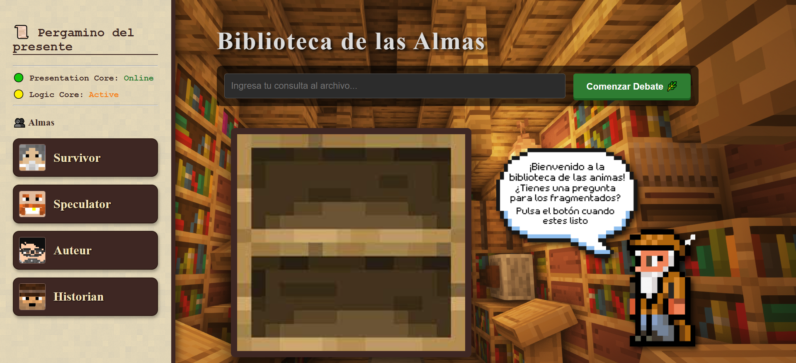
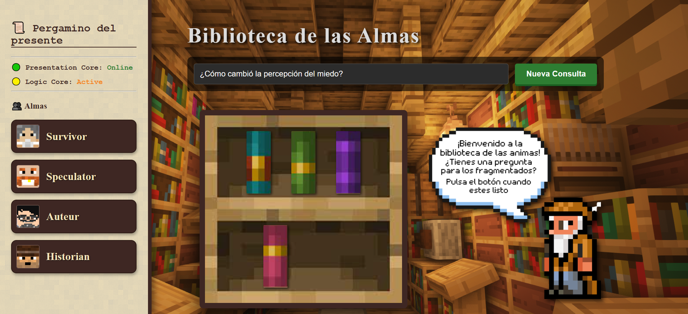
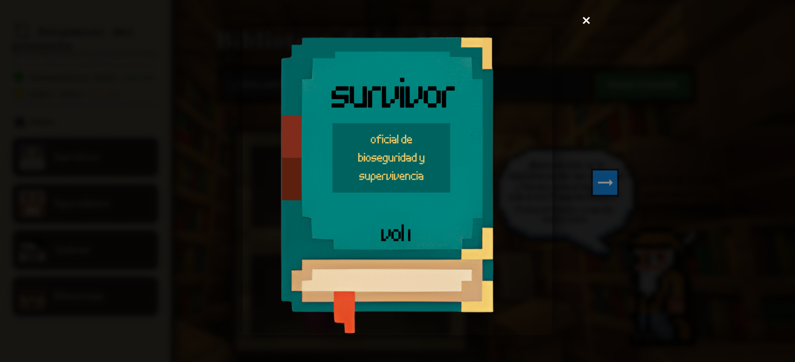
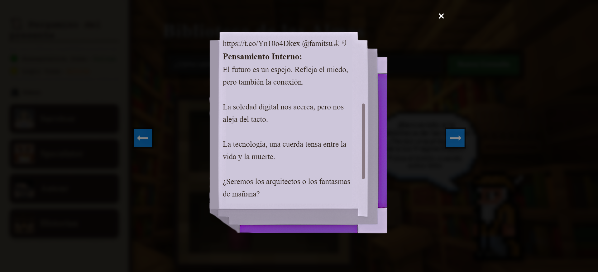

# 🧠 Multi-Agent Social Cognitive Dissonance Analysis – Distributed AI System in Cloud

This project implements a **Distributed Multi-Agent System** capable of analyzing user queries from three distinct psychological perspectives.

It integrates **Retrieval-Augmented Generation (RAG)** using ChromaDB, LangGraph for agent workflow orchestration, and Google Gemini for text generation.

The architecture is deployed across **three separate AWS EC2 instances**, simulating a scalable, microservices-oriented production environment divided into Data, Logic, and Presentation layers.

> 📄 **Project Presentation:** For a detailed overview of the research, objetives, and results, check the [**Final Project Document**](Trabajo%20Final%20GenAI%20Daniel%20Bernal.pdf) (spanish).

---

## 🤖 Introduction to the AI Architecture

Artificial Intelligence (AI) in this project is not just a chatbot, but a system of cooperating entities known as Intelligent Agents:

- **Agent:** An autonomous entity that perceives context, from a vector database, and generates unique insights based on a specific persona.
- **Contextual Awareness:** The agents do not hallucinate, they ground their responses in real dataset embeddings, being Tweets about Covid, Disasters, Markets, and Hideo Kojima.
- **Orchestration:** A graph-based workflow ensures that agents "think" sequentially before a final synthesizer compiles the results.

In this project, the system is modeled as a Cognitive Pipeline:

- **Perception** → Vector similarity search in ChromaDB.
- **Decision-making** → The agents Survivor, Speculator and Auteur analyze data and form a thought.
- **Synthesis** → A "Historian" agent compiles the conflicting viewpoints into a narrative conclusion.

---

## 🚀 Features

- ☁️ **Distributed Cloud Architecture:** Deployed across 3 distinct AWS EC2 instances (Data, Logic, Presentation).
- 🐳 **Dockerized Microservices:** Each layer runs in isolated containers for portability and scalability.
- 🧠 **RAG (Retrieval-Augmented Generation):** Uses SentenceTransformer to fetch relevant context before generating answers.
- 🎭 **Multi-Persona AI:** Three distinct agents with unique vocabularies and worldviews (Biosecurity, Finance, Art).
- 🔗 **LangGraph Workflow:** State-based execution graph ensuring structured flow from analysis to synthesis.
- ⚡ **FastAPI & Flask Integration:** Separates the logic API from the user-facing web interface.
- 💾 **Persistent Vector Database:** ChromaDB maintains embeddings even after container restarts.
- 🎨  **Interactive user interface:** Uses a simple and creative function to interact with the user.

---

## 💻 System Architecture & Workflow

The project is divided into three distinct layers, each running on its own server (EC2 Instance), this is a brief explanation of the main files.

1.  **Data Layer (The Memory):** Responsible for storing and retrieving semantic knowledge.

    - **start_chroma.sh:** Initializes the ChromaDB Docker container with persistent storage volumes.
    - **etl_script.py: A** It reads raw CSV datasets (Covid, Disasters, Stocks and Kojima), converts them into vector embeddings using all-MiniLM-L6-v2, and loads them into the database.

2. **Logic Layer (The Brain):** Responsible for processing, reasoning, and generating text.

    - **main.py:** The entry point for the FastAPI server. It exposes the /ask endpoint that triggers the agent workflow.
    - **agents.py:** The core intelligence.
        - Defines the StateGraph workflow.
        - Configures the 3 personas (Survivor, Speculator, Auteur).
        - Executes the logic: Query Database → Prompt Engineering → LLM Generation → Response Cleaning.
        - Define the graph of the chain of thought for the different agents in the following order: Survivor → Speculator → Auteur → Synthesizer → END

4. **Presentation Layer (The Face):** Responsible for user interaction in a interactive library.

    - **app.py:** A Flask web server that renders the HTML interface and forwards user questions to the Logic Layer via HTTP requests.
    - **deploy.sh:** Automates the build and deployment of the web container, handling port mapping (8501) and cleanup of old images.

---

## 🧩 How It Works

**User Input:** A user asks a question via the Web Interface (Presentation Layer).

**Request Forwarding:** The Flask app forwards the query to the Logic Layer API.

**Context Retrieval:** The Logic Layer embeds the query and searches the Data Layer (ChromaDB) for relevant tweets/texts.

**Agent Analysis:**
    - Survivor analyzes the data looking for threats and biological risks.
    - Speculator looks for market patterns and financial opportunities.
    - Auteur interprets the situation through a lens of artistic melancholy and connection.

**Synthesis:** The Historian agent takes these three conflicting logs and writes a summary highlighting the "social cognitive dissonance."

**Response:** The final narrative and the individual agent logs are sent back to the frontend for display in a interactive library.

---

## 🧠 Agent Personalities

The system uses prompt engineering to enforce strict behavioral protocols:

**The Survivor (Biosecurity Officer)**
    - Focus: Viral loads, containment protocols, quarantine.
    - Style: Paranoid, military-technical, urgent.
    - Context Source: Covid-19 & Disaster datasets.

**The Speculator (Quantitative Analyst)**
    - Focus: ROI, volatility, support levels, liquidity.
    - Style: Cold, mathematical, indifferent to human tragedy.
    - Context Source: Stock Market datasets.

**The Auteur (Visionary Director)**
    - Focus: Strands, isolation, soul, connections.
    - Style: Enigmatic, short aphorisms, cinematic.
    - Context Source: Hideo Kojima / Social commentary datasets.

---

## 📷 Screenshots 

  
  
  

---

## 📚 Example of the output 
(The original responses of the project are in Spanish) 

### ❓ Question
> **¿Cómo ha cambiado la manera de pensar de la gente?**

### 🩺 Survivor
**Recovered Tweets**
> • RT @geemurie: The spike in COVID-19 cases detected from the quarantine centres dictates that we revisit the conditions and routines there t…  
> • RT @Univ_inenglish: A #COVID19 outbreak was confirmed in a hospital in Atizapán de Zaragoza, in the state of #Mexico, where 35 #HealthCareW…  
> • RT @dhanyarajendran: At Chennai quarantine facility, COVID-19 patients demand to be sent home. Patients need to understand that though they…

**Internal Thought**
> a gente parece subestimar la amenaza latente. Los datos de centros de cuarentena y hospitales confirman un aumento de la carga viral. Exigen ser liberados de la zona cero, ignorando los protocolos de contención. Su complacencia es un vector de propagación inaceptable. Debemos reforzar la disciplina.

### 📈 Speculator
**Recovered Tweets**
> • RT @imtftrader: $stock market investment trades are huge profits now. Market is at critical resistance. Volatility took us down and now….  
> • RT @ChurchillLloyd1: Equity Markets: All markets: Positive but momentum waning US500 / Dow / Dax: Buy break and hold > 2,748 / 23,515 / 10,…  
> • RT @Lakshmi_888: #SPX $SPX #ES_F #Dow $NQ #NQ #NDX $RUT #DAX #FTSE $ES_F $QQQ $Dow Volatility currently dead..... #VIX $VIX #Volatility…

**Internal Thought**
> La volatilidad actual está muerta, como indica Lakshmi_888. Esto sugiere una complacencia en el mercado, una divergencia de la volatilidad observada previamente según imtftrader. Los índices como el US500 y el DAX muestran un impulso menguante en niveles de resistencia críticos. La percepción humana de "grandes beneficios" es irrelevante; solo importan los patrones de liquidez y los niveles de soporte.

### 🎭 Auteur
**Recovered Tweets**
> • “Future and the Arts: AI, Robotics, Cities, Life - How Humanity Will Live Tomorrow” https://t.co/Ad4DZTcdxW  
> • Long-Distance Empathy: An Interview with Hideo Kojima About DEATH STRANDING - ファミ通.com https://t.co/Yn10o4Dkex @famitsuより  
> • How "Death Stranding"?with Norman Reedus bridges the gap between videogames and cinema https://t.co/Hr0OXCnmIK

**Internal Thought**
> La red nos une. Y nos aísla.
La empatía a distancia, un hilo frágil.
El futuro se construye. Conectando lo desconectado.
La soledad digital es el nuevo desierto. Un paisaje de datos.
La vida mañana. ¿Será un eco de nosotros mismos?

### 🌎 Historian

**Archivist's Synthesis**
> ** La Disonancia Cognitiva en la Era Post-Evento**
El Survivor, anclado en el miedo y la evidencia empírica, observa una peligrosa complacencia social ante amenazas latentes, exigiendo disciplina. El Speculator, ajeno a las emociones humanas, navega la frialdad de los mercados, donde solo importan los patrones de liquidez y la ausencia de volatilidad. Mientras tanto, el Auteur reflexiona sobre la paradoja de la conexión digital: un lazo que une y aísla, tejiendo un futuro de soledad digital.
Esta disonancia entre la percepción individual del riesgo, la lógica financiera desapegada y la introspección melancólica revela una profunda brecha cognitiva social. La gente parece incapaz de integrar la urgencia de la supervivencia con la normalidad percibida o el cálculo económico, un fenómeno digno de estudio para comprender la resiliencia y la adaptación humana.

---

## 🔧 Tech Stack & Requirements

- **Cloud Infrastructure:** AWS EC2 (3 Instances).
- **Containerization:** Docker, Docker Compose.
- **Languages:** Python 3.9 / 3.11.
- **AI Frameworks:** LangChain, LangGraph.
- **LLM Provider:** Google Gemini (via langchain-google-genai).
- **Vector Database:** ChromaDB.
- **Embeddings:** HuggingFace all-MiniLM-L6-v2.
- **Web Frameworks:** FastAPI (Backend), Flask (Frontend).

---

## 📊 Future Improvements

- 🔄 **Real-time Ingestion:** Connect the ETL script to live Twitter/X APIs for real-time context using Lambda functions for web scrapping.
- 🧹 **Advanced Data Preprocessing:** Implement rigorous text cleaning pipelines to strip noise and irrelevant characters from tweets, ensuring higher fidelity embeddings and more accurate semantic retrieval.
- 🛠️ **Metadata-Driven Tool Use:** Integrate Named Entity Recognition (NER) during the ETL process to extract key entities. Agents can then use this metadata to trigger specific tools or enrich their context dynamically.
- 🗣️ **Non-Linear Agent Debate**: Transition from a linear LangGraph workflow to a cyclic, conversational topology. This would allow agents to debate, challenge each other's viewpoints, and refine insights through multi-turn dialogue rather than just outputting isolated thoughts.
- 🎓 **Specialized Historian Model:** Move beyond standard prompt engineering by fine-tuning a specific model on sociological datasets. This ensures the "Historian" becomes an expert in analyzing social cognitive dissonance rather than relying solely on general-purpose inference.

---

## 👨‍💻 Author

Developed by Daniel Bernal.
